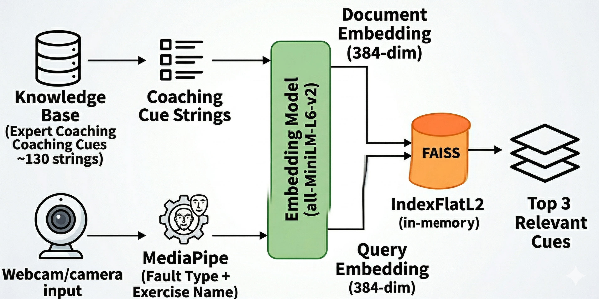

# RAG Agentic Fitness Coach

I built a real-time fitness coaching system that runs entirely on a local machine — no cloud, no API keys, no internet required. A webcam watches you exercise, MediaPipe tracks your joint angles at ~30fps, and when it detects a form fault, an agentic RAG pipeline fires: FAISS retrieves the three most relevant expert coaching cues, and a local LLM generates a short on-screen cue in real time.

> **Demo coming soon** — screen recording of the coach firing mid-squat will go here.

---

## Results

I evaluated the system against 398 video segments with ground-truth coach transcripts:

| Metric | Score | Notes |
|---|---|---|
| BERTScore | **0.859** | Semantic similarity — when it fires, what it says is correct |
| Precision@3 | 0.640 | 64% of retrieved cues are directly relevant |
| Recall@3 | **1.000** | Every fault query surfaces at least one relevant cue |
| F1@3 | 0.749 | Combined retrieval score |
| METEOR | 0.072 | Low — paraphrase gap, not wrong answers |
| ROUGE-L | 0.046 | Low — short outputs don't share surface form with GT |
| Temporal F-score | 0.067 | Low — coverage gap for exercises without angle cycles |

The core retrieval layer is essentially perfect (Recall@3 = 1.0). The coverage gap is the main open problem: exercises that don't produce a detectable joint angle cycle rarely trigger the audit gate.

---

## Architecture



Two things happen in parallel. The knowledge base path encodes ~130 expert coaching cues into a FAISS in-memory index at startup. The live path takes the detected fault type and exercise name from MediaPipe, encodes them with the same model, and queries the index for the top 3 nearest cues. Those cues get handed to a local LLM which condenses them into a single short coaching line.

---

## How it works

I designed two loops running simultaneously:

**Fast loop (every frame)** — MediaPipe reads the joint angle and updates the rep count and movement phase (`up` / `down`). This runs at full camera speed and never blocks.

**Slow loop / agentic gate** — if the athlete stays in the `down` phase below a threshold angle for ~1.5 seconds, the RAGCoach classifies the fault, retrieves the 3 most relevant cues from the FAISS index, and sends them as grounded context to the LLM. The LLM returns a single cue which appears on screen.

Session memory handles repetition: if the same fault fires 3 consecutive times, the coach suppresses itself and gives the athlete time to self-correct rather than repeating the same advice.

```
Webcam
  └─ tracker.py               # MediaPipe — extracts joint angle
       └─ update_coach_logic.py   # Rep counting + anomaly gate
            └─ auditor.py         # Fault classification + snapshot
                 └─ rag_coach.py  # FAISS retrieval + Ollama LLM
                      └─ Screen overlay (COACH: ...)
```

---

## Tech stack

- **MediaPipe** — real-time pose estimation at ~30fps
- **sentence-transformers** (`all-MiniLM-L6-v2`) — 384-dim semantic embeddings
- **FAISS** (`IndexFlatL2`) — in-memory exact nearest-neighbour search
- **Ollama** + `llama3.2:3b` — local LLM inference, no cloud
- **OpenCV** — webcam capture and overlay rendering

---

## Requirements

- Python 3.10 or 3.11 (mediapipe 0.10.14 does not support 3.12+)
- A webcam
- [Ollama](https://ollama.com) installed and running locally

---

## Setup

**1. Install Ollama and pull the model**
```bash
ollama pull llama3.2:3b
```

**2. Start the Ollama server** (keep this terminal open)
```bash
ollama serve
```

**3. Install Python dependencies**
```bash
pip install mediapipe==0.10.14
pip install faiss-cpu sentence-transformers ollama opencv-python
```

> Pin mediapipe to `0.10.14` — newer versions have breaking API changes.

---

## Running

**Verify retrieval is working first (no webcam needed)**
```bash
python debug_rag.py
```
Check that the cues printed for each fault type make sense. If they look off, edit `FAULT_QUERIES` in `rag_coach.py` before proceeding.

**Run the full pipeline**
```bash
python test_tracker.py
```

Press `q` to quit. Use keyboard shortcuts to switch exercises — see `EXERCISE_MAP` in `test_tracker.py`.

---

## What you'll see

On screen:
- `Reps: N | Phase: up/down` — live rep counter and movement phase
- `COACH: <cue>` — coaching feedback when a fault is detected (green = settled, orange = LLM processing)

In the console:
```
[RAGCoach] Loading sentence encoder...
[RAGCoach] Ready.
Agentic Tracker Running... Press 'q' to quit.
REPS: 1
--- VLM AUDIT TRIGGERED: Snapshot saved to audits/anomaly_1234567890.jpg ---
[Auditor] Triggered — fault=stuck phase=down angle=78
```

Snapshots of fault frames are saved to the `audits/` folder automatically.

---

## Fault classification

The RAGCoach classifies faults based on joint angle at the time the anomaly gate fires:

| Angle | Fault | Description |
|---|---|---|
| < 80° | `stuck` | Deep position but can't drive up |
| 80° – 110° | `shallow_depth` | Not reaching full depth |
| ≥ 110° | `knee_valgus` | Potential up-phase form issue |

Spatial and height-based exercises use different metrics (joint spread, knee height relative to hip) with their own fault types.

---

## Expanding the knowledge base

The RAGCoach exposes a method to add cues at runtime without rebuilding the FAISS index:

```python
coach = auditor._get_coach()
coach.add_to_knowledge_base([
    "Keep your chest tall throughout the movement.",
    "Drive your knees out as you descend.",
])
```

---

## Project structure

```
├── test_tracker.py        # Entry point — wires all modules, renders overlay
├── tracker.py             # PoseTracker — MediaPipe pose extraction
├── update_coach_logic.py  # State machine — rep counting + anomaly gate
├── auditor.py             # Agentic bridge — fault classification, calls RAGCoach
├── rag_coach.py           # RAGCoach — FAISS index, retrieval, Ollama LLM
├── debug_rag.py           # Standalone retrieval + LLM sanity check
├── eval/                  # Benchmark evaluation scripts and manifest
├── audits/                # Saved snapshots of fault frames (auto-created)
└── README.md              # This file
```

---

## Known limitations

- Fault classification uses joint angle only — true knee valgus detection requires 2D joint position analysis
- Knowledge base is hardcoded; no external dataset loaded by default
- Session memory resets on every run (not persisted to disk)
- Exercises without a detectable angle cycle (e.g. some stretches) rarely trigger the audit gate — this is the main driver of the low temporal F-score
- Coaching is visual only — no audio output
